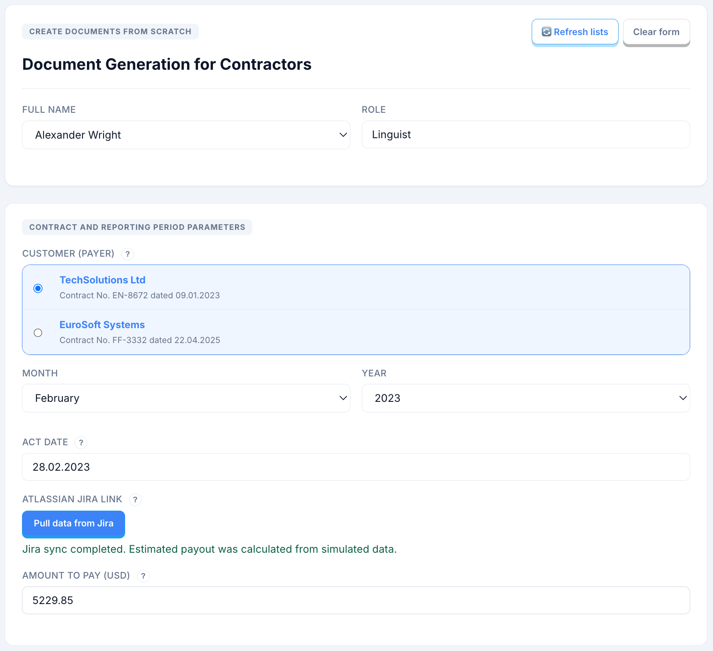
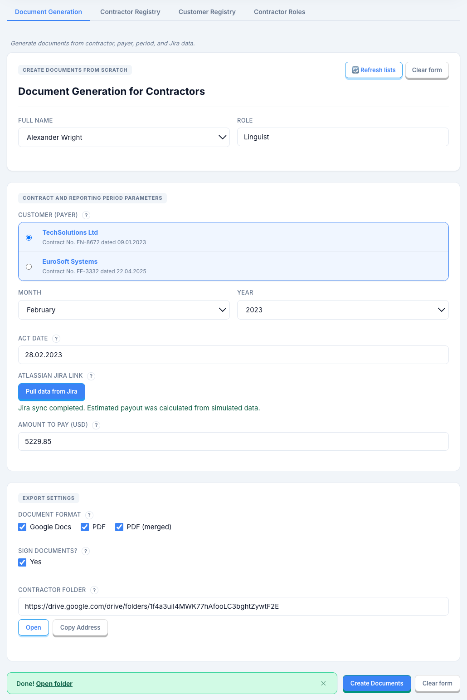
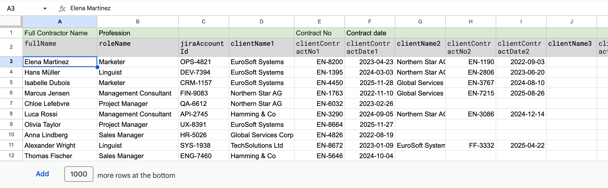
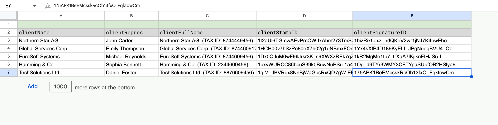

# Demo Flow

## Step 1: Input and Selection
The operator opens the app and checks core data in the four-tab control center (Generation, Contractor Registry, Customer Registry, Contractor Roles).

Optional Step 1A: Data Refresh in Registries
- If contractor/customer/role records are outdated, the operator updates them directly in registry tabs before generation.
- This keeps payout context current for the run.

After optional updates, the operator selects contractor/customer/month/year in the Generation tab.

Main generation screen:

Full generation view in one screen:

Registry examples:

## Step 2: Validation
The operator runs Jira sync. The system validates context completeness and keeps generation locked until the gate passes.

## Step 3: Processing
After validation, the system captures a run snapshot, applies allocation checks, and prepares output targets with concurrency protection.

Optional debug path: operators can run mock-mode checks before live generation.

## Step 4: Output Generation
The pipeline generates billing artifacts (reports, SOW files, combined outputs), applies template mappings, and stores files in the target Drive folder.

## Step 5: Result and Traceability
Generated files are stored in the run folder, and the input record links to that folder for direct evidence lookup.

## User Perspective Summary
The flow is linear and operator-friendly: update registries if needed, select context, validate with Jira sync, generate artifacts, and review outputs. It removes manual packet assembly and preserves a clear trace from source to result.

## Navigation
- [README](README.md)
- [Overview](OVERVIEW.md)
- [Architecture](ARCHITECTURE.md)
- [Features](FEATURES.md)
- [Use Cases](USE_CASES.md)
- [Security and Disclosure](SECURITY_AND_DISCLOSURE.md)
- [Demo Access and Try Path](DEPLOYMENT.md)
- [Files](FILES.md)
