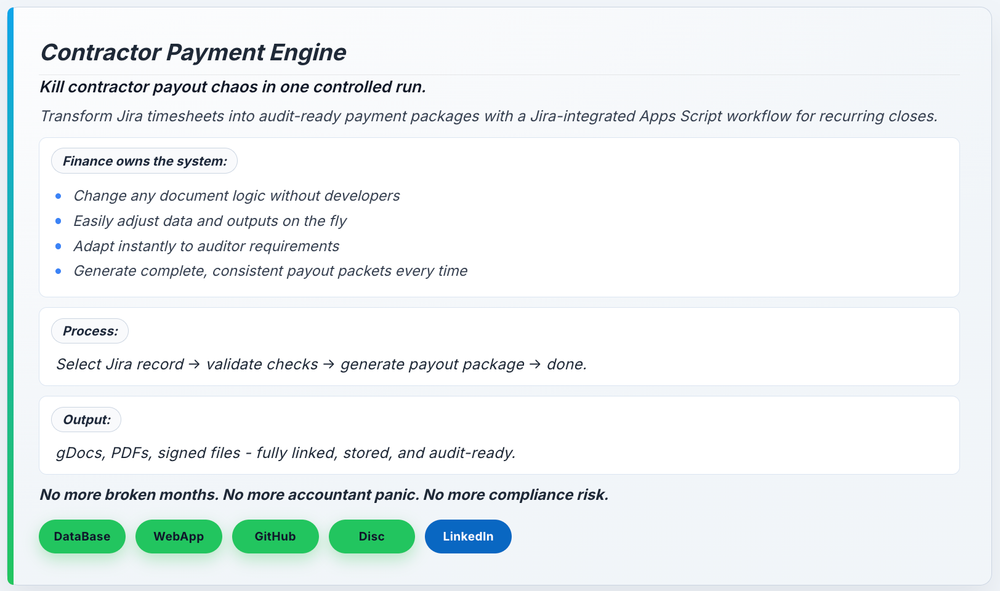

# Audit-Friendly Contractor Payment Engine

Manual contractor payout packets usually fail on operations: too many handoffs, too much spreadsheet drift, and weak evidence consistency. This demo shows a Jira-gated workflow that validates context first, then generates payout documents in one controlled run.

**Typical transformation: 1 to 3 hours of manual prep per contractor packet -> under 10 minutes in one guided run.**

### Hero Section

## Key Capabilities
- One guided flow from selection to generated payout package.
- Hard validation gate before generation (no partial runs).
- Four-tab control model in one app: Generation, Contractor Registry, Customer Registry, Contractor Roles.
- Jira-linked context load before payout amount is accepted.
- Controlled allocation and checksum consistency to the cent.
- Multi-artifact output generation with archive-first folder handling.
- Direct traceability from selected input to output folder.

## Outcome Snapshot
| Dimension | Before | After |
|---|---|---|
| Packet prep time | 1 to 3 hours per contractor | Under 10 minutes per contractor |
| Compliance signal | Inconsistent evidence quality | 0 bank/tax claims in a 6-month window |
| Monthly throughput | Limited by manual effort | 50+ contractors and about 200 to 500 generated docs |
| Team load | Repeated cross-team handoffs | About 20% lower recurring finance/accounting effort |
| Data control | Spreadsheet edits in scattered places | In-app control across 4 tabs |

### Screens You Can Review
Main generation flow:

Registry example:

## Demo Access
- Deployed Application: https://script.google.com/macros/s/AKfycbyrbdZGJvIlB6GStnnLtYaIi233pMD99_L1wYDOlCJvNbCe1Vcl7eDxJGbU5vUgXjJG/exec
- Database: https://docs.google.com/spreadsheets/d/19PDr-R5DAtLRL1EVh2zVdjLidEXx9b3L1YQnxs5cfIg/edit?usp=sharing
- Generated Documents (Drive): https://drive.google.com/drive/folders/174NopgrVC9V-PW6uw1kxrGJDXHrzgslo
- Public Showcase Repository: https://github.com/keindabest/sc-demo-contractor-report-and-payment-engine-showcase

## Quick How to Try Demo
1. Open the deployed application.
2. Select contractor, customer, month, and year.
3. Click Jira sync to load validated context.
4. Click `Create Documents`.
5. Open the Drive folder and inspect generated packet files.

## Demo Documentation Map
Start here:
1. [Overview](OVERVIEW.md)
2. [Demo Flow](DEMO_FLOW.md)
3. [Architecture](ARCHITECTURE.md)

Then review:
- [Features](FEATURES.md)
- [Use Cases](USE_CASES.md)
- [Security and Disclosure](SECURITY_AND_DISCLOSURE.md)
- [Demo Access and Try Path](DEPLOYMENT.md)
- [Files](FILES.md)

## Disclosure (Short)
This is a sanitized public showcase. It includes synthetic screenshots and synthetic sample artifacts, and excludes secrets, private mappings, and internal orchestration details.

## License
This demo package is released under the [MIT License](LICENSE).

## Author
Daniil Kein
